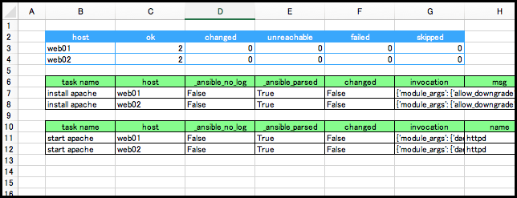

# ansible-result2excel

Tools to convert ansible execution results (JSON) to Excel.



## Requirement

* [openpyxl](http://openpyxl.readthedocs.io/en/stable/)

## Install

```shell-session
$ pip install openpyxl
$ git clone https://github.com/sky-joker/ore-ore-ansible
$ cd ore-ore-ansible/tools/ansible-result2excel
$ chmod +x ansible-result2excel.py
```

## Ansible configuration

Please change the result output to JSON and change retry file output to False.

```shell-session
$ vi ansible.cfg
(snip)
stdout_callback = json
(snip)
retry_files_enabled = False
```

## Usage

Specify the JSON file as an argument to `ansible-result2excel.py`.
If there is no problem Excel file(default:output.xlsx) will be output.

```shell-session
$ ansible-playbook example.yml -i inventory | tee result.json
$ ./ansible-result2excel.py -f result.json
$ ls
example.yml inventory   output.xlsx
```