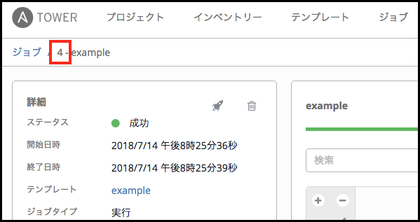
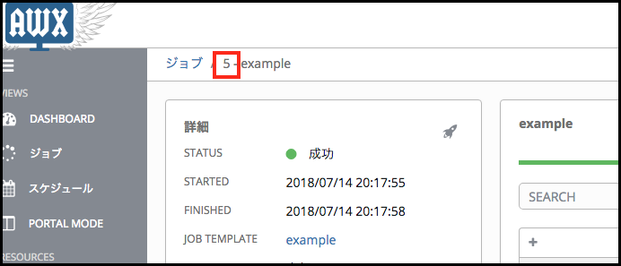

# awx-get-job-extv

This tool get extra_vars from the job result executed with Ansible Tower(AWX).

## Requirement

* requrests

## Install

```
$ pip install openpyxl
$ git clone https://github.com/sky-joker/ore-ore-ansible
$ cd ore-ore-ansible/tools/awx-get-job-extv
$ chmod +x awx-get-job-extv.py
```

## Usage

For example to get extra_vars from Ansible Tower.



```
$ ./awx-get-job-extv.py -s 192.168.0.234 -id 4 --ssl --json-indent 2
Password:
{
  "MSG": [
    "HOGE",
    "FUGA",
    "TEST"
  ]
}
```

For example to get extra_vars from AWX.



```
./awx-get-job-extv.py -s 192.168.0.237 -id 5 --json-indent 2
Password:
{
  "MSG": [
    "HOGE",
    "FUGA",
    "TEST"
  ]
}
```
